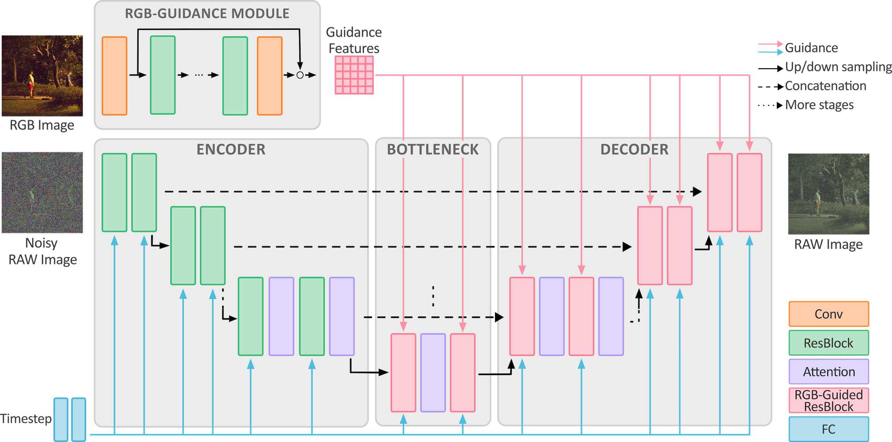

# RAW-Diffusion: RGB-Guided Diffusion Models for High-Fidelity RAW Image Generation

[](https://arxiv.org/abs/2411.13150)

> [**RAW-Diffusion: RGB-Guided Diffusion Models for High-Fidelity RAW Image Generation**](https://arxiv.org/abs/2411.13150) <br>
> Christoph Reinders, Radu Berdan*, Beril Besbinar*, Junji Otsuka, and Daisuke Iso

Official implementation of the paper "RAW-Diffusion: RGB-Guided Diffusion Models for High-Fidelity RAW Image Generation" [WACV 2025].

## Overview



> **Abstract:** Current deep learning approaches in computer vision primarily focus on RGB data sacrificing information. In contrast, RAW images offer richer representation, which is crucial for precise recognition, particularly in challenging conditions like low-light environments.  The resultant demand for comprehensive RAW image datasets contrasts with the labor-intensive process of creating specific datasets for individual sensors. To address this, we propose a novel diffusion-based method for generating RAW images guided by RGB images. Our approach integrates an RGB-guidance module for feature extraction from RGB inputs, then incorporates these features into the reverse diffusion process with RGB-guided residual blocks across various resolutions.  This approach yields high-fidelity RAW images, enabling the creation of camera-specific RAW datasets. Our RGB2RAW experiments on four DSLR datasets demonstrate state-of-the-art performance. Moreover, RAW-Diffusion demonstrates exceptional data efficiency, achieving remarkable performance with as few as 25 training samples or even fewer. We extend our method to create BDD100K-RAW and Cityscapes-RAW datasets, revealing its effectiveness for object detection in RAW imagery, significantly reducing the amount of required RAW images. 

## Citation

If you find our work useful, please consider citing our paper:
```bibtex
@inproceedings{reinders2025rawdiffusion,
  title = {{{RAW-Diffusion}}: {{RGB-Guided Diffusion Models}} for {{High-Fidelity RAW Image Generation}}},
  author={Reinders, Christoph and Berdan, Radu and Besbinar, Beril and Otsuka, Junji and Iso, Daisuke},
  booktitle={IEEE/CVF Winter Conference on Applications of Computer Vision (WACV)},
  year={2025},
}
```

## Installation
```bash
git clone git@github.com:SonyResearch/RAW-Diffusion.git
cd RAW-Diffusion

conda create -n rawdiffusion python=3.11
conda activate rawdiffusion

# Install PyTorch (https://pytorch.org/get-started/locally/)
# The results are produced with PyTorch 2.0.1 and CUDA 11.8
conda install pytorch torchvision pytorch-cuda=11.8 -c pytorch -c nvidia

pip install -r requirements.txt
```


## Datasets

We perform experiments on FiveK Nikon, FiveK Canon, NOD Nikon, and NOD Sony. The details for preparing the datasets are provided in [datasets/README.md](./datasets/README.md).

## Running Experiments

You can run the experiments either locally or via SLURM. Below are examples for both methods.

### Running Locally

To run an experiment locally, use the following command:
```bash
python train.py dataset=DATASET general.seed=SEED
# for example
python train.py dataset=fivek_nikon general.seed=0
```

### Running via SLURM

To run an experiment using SLURM, specify the SLURM partition by replacing `SLURM_PARTITION` with the appropriate partition name, and execute the following command:

```bash
python train.py dataset=DATASET general.seed=SEED "hydra.launcher.partition=SLURM_PARTITION" -m
# for example
python train.py dataset=fivek_nikon general.seed=0 "hydra.launcher.partition=SLURM_PARTITION" -m
```

## RGB2RAW

For training and evaluation of the main experiments can be performed as follows.

#### FiveK Nikon
```bash
python train.py dataset=fivek_nikon general.seed=0
python sample.py dataset=fivek_nikon general.seed=0
```

#### FiveK Canon
```bash
python train.py dataset=fivek_canon general.seed=0
python sample.py dataset=fivek_canon general.seed=0
```

#### NOD Nikon
```bash
python train.py dataset=nod_nikon general.seed=0
python sample.py dataset=nod_nikon general.seed=0
```

#### NOD Sony
```bash
python train.py dataset=nod_sony general.seed=0
python sample.py dataset=nod_sony general.seed=0
```

## Small Data RGB2RAW

Training and evaluation of RAW-Diffusion with limited data.

#### FiveK Nikon
```bash
python train.py dataset=fivek_nikon_subsample dataset.train.max_items=25 general.seed=0
python sample.py dataset=fivek_nikon_subsample dataset.train.max_items=25 general.seed=0
```

#### FiveK Canon
```bash
python train.py dataset=fivek_canon_subsample dataset.train.max_items=25 general.seed=0
python sample.py dataset=fivek_canon_subsample dataset.train.max_items=25 general.seed=0
```

#### NOD Nikon
```bash
python train.py dataset=nod_nikon_subsample dataset.train.max_items=25 general.seed=0
python sample.py dataset=nod_nikon_subsample dataset.train.max_items=25 general.seed=0
```

#### NOD Sony
```bash
python train.py dataset=nod_sony_subsample dataset.train.max_items=25 general.seed=0
python sample.py dataset=nod_sony_subsample dataset.train.max_items=25 general.seed=0
```

## Cityscapes-RAW and BDD100K-RAW

Training of RAW-Diffusion on limited amount of RAW images and generation of Cityscapes-RAW and BDD100K-RAW for NOD Nikon and NOD Sony.

#### NOD Nikon
```bash
python train.py dataset=nod_nikon_h416_subsample dataset.train.max_items=100
python sample.py dataset/train=nod_nikon_h416_subsample dataset.train.max_items=100 dataset/val=cityscapes_h416 save_pred=true rgb_only=true
python sample.py dataset/train=nod_nikon_h416_subsample dataset.train.max_items=100 dataset/val=bdd_h416 save_pred=true rgb_only=true diffusion_val.timestep_respacing=ddim6
```

#### NOD Sony
```bash
python train.py dataset=nod_sony_h416_subsample dataset.train.max_items=100
python sample.py dataset/train=nod_sony_h416_subsample dataset.train.max_items=100 dataset/val=cityscapes_h416 save_pred=true rgb_only=true
python sample.py dataset/train=nod_sony_h416_subsample dataset.train.max_items=100 dataset/val=bdd_h416 save_pred=true rgb_only=true diffusion_val.timestep_respacing=ddim6
```

## Object Detection

The object detection pipeline is provided under `object_detection`. Please see [object_detection/README](./object_detection/README.md) for details.

## Acknowledgements

We are grateful for the following, but not limited to these, wonderful open-source repositories.

- [semantic-diffusion-model](https://github.com/WeilunWang/semantic-diffusion-model)
- [guided-diffusion](https://github.com/openai/guided-diffusion)